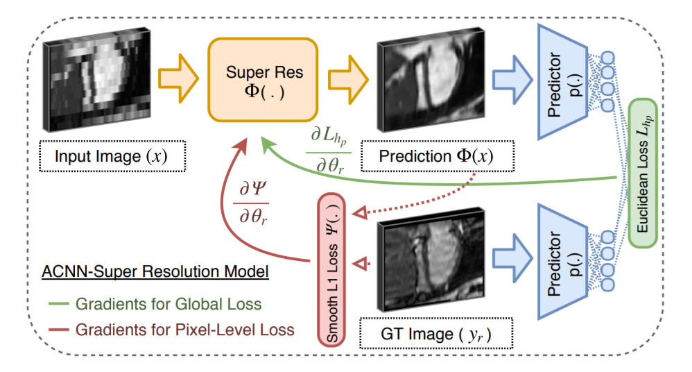

        ACNN: Anatomically Constrained Neural Networks
An approach to incorporate the prior knowledge about the shape of organ from bio-medical images into the neural networks. Their work was
mainly inspired by initial research in shape prior and image segmentation, which is based on PCA based active shape models and PCA based statistical models. Oktay et. al. used their framework for the two major task mentioned below for the biomedical
image processing:
1. Image Segmentation
2. Image Super- Resolution

Image Segmentation Networks:

Image Super Resolution Networks:

The experimental results proves that, after applying this constraint about the shape of organ in neural networks. Neural networks performed far better in segmentation and super resolution task.
